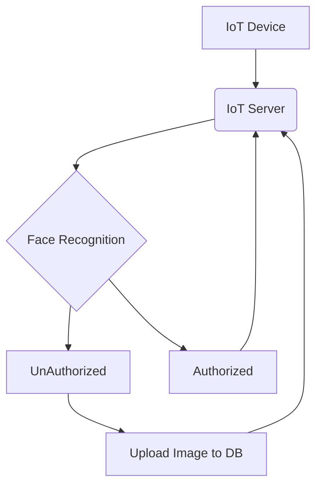

# IoT Application    

## Description

This IoT application is designed to use a Python background server for face recognition. The application uses an IoT camera to capture images of individuals and sends the image to the server for recognition. If the person is authorized, the server sends a notification to the authorized person. If the person is not authorized, the server sends a notification to the client application along with the image captured by the IoT camera.

## How it Works

The IoT camera captures an image of an individual and sends it to the Python background server. The server then uses facial recognition software to identify the individual in the image. If the individual is authorized, the server sends a notification to the authorized person. If the individual is not authorized, the server sends a notification to the client application along with the image captured by the IoT camera.

## Technologies Used

- Python ( server-side face recognition )

- react-native ( client-application notification handler )

- IoT camera & sensors

## Benefits

This IoT application provides a secure way of identifying individuals. The use of facial recognition software ensures that only authorized individuals are allowed access. Additionally, the use of the IoT camera allows for remote monitoring of individuals, providing an added layer of security.
